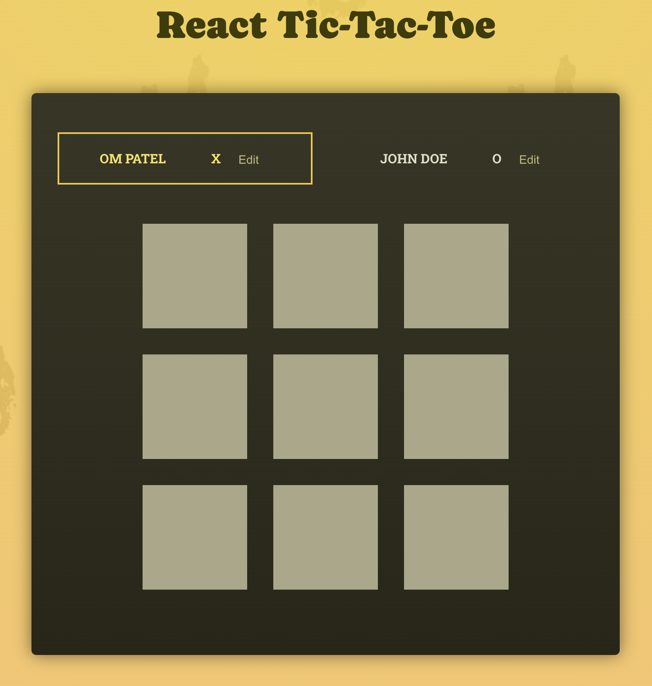

# React Tic Tac Toe

React Application of Tic Tac Toe



## Features

- Refined and contemporary design featuring adaptable color schemes and backgrounds.
- Utilization of React Components and Hooks for state management and interactivity. 
- Dynamic player naming allowing users to customize player names.
- Winning combination detection to automatically determine and announce the game winner.
- Interactive UI elements including buttons and input fields for an enhanced user experience.
- Reset functionality allowing users to restart the game easily.

## Usage

This website is built with [React](https://react.dev/)

In order to customize this website, you need to install [Node.js](https://nodejs.org/en/). Then, clone this repository and run:

```bash
npm install
```

To start the development server, run:

```bash
npm run dev
```


